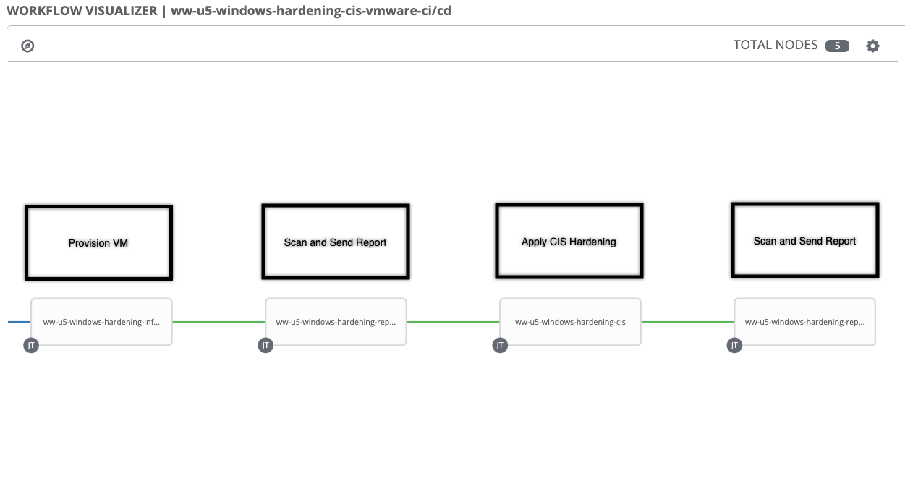
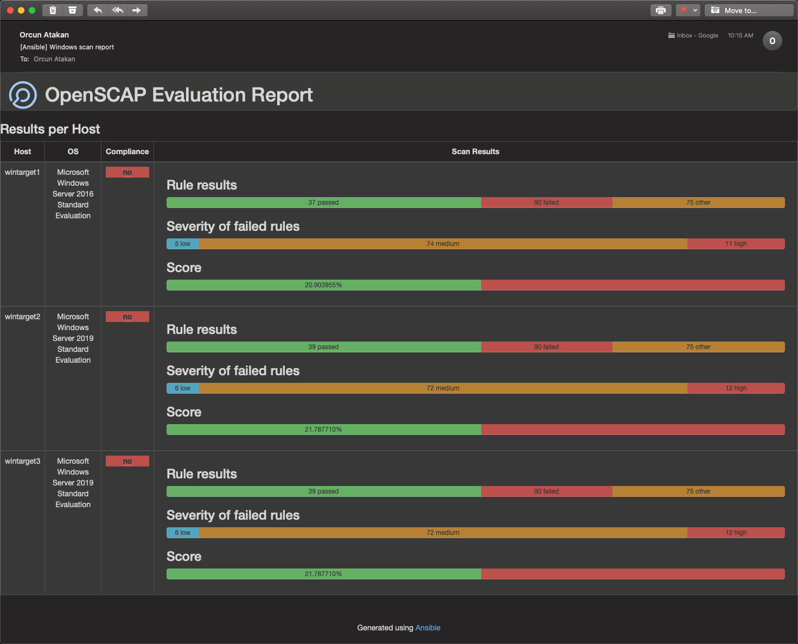
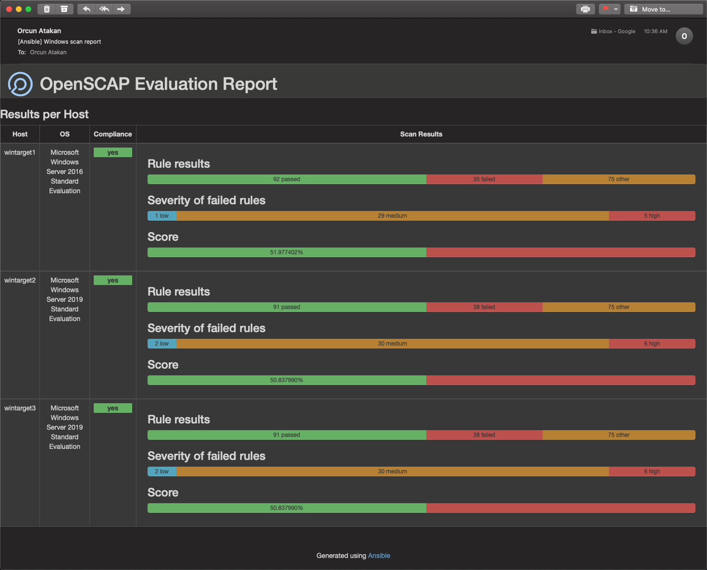

# ansible-windows-hardening-example-
This repo contains Ansible playbook examples to harden Windows systems with CIS and STIG and report the results

### Provision target Windows VMs to VMware, Azure, Red Hat Virtualization, OpenShift environments
    - instance_create_multi.yml
### Openscap scan, generate and email report
    - scan_report.yml
### Windows CIS Hardening
    - windows_cis_harden.yml
### Windows STIG Hardening
    - windows_stig_harden.yml
 
## Example implementation of hardening and reporting with Ansible Automation Platform

### Workflow (CI/CD Automation Pipeline)

### First Email Sent Showing Non-Compliance

### Second Email Sent Showing Compliance

